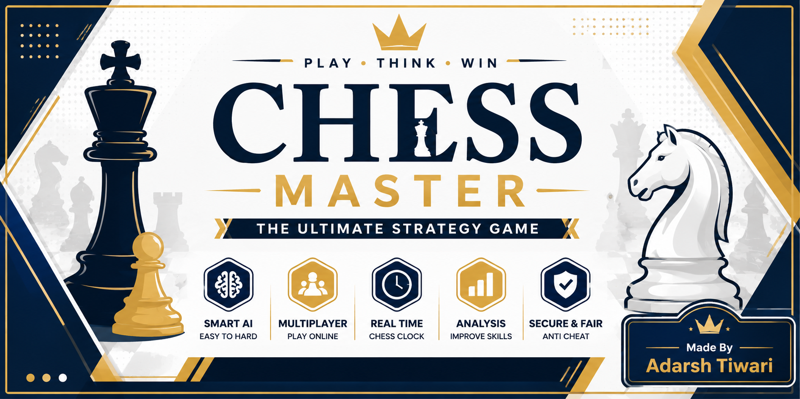
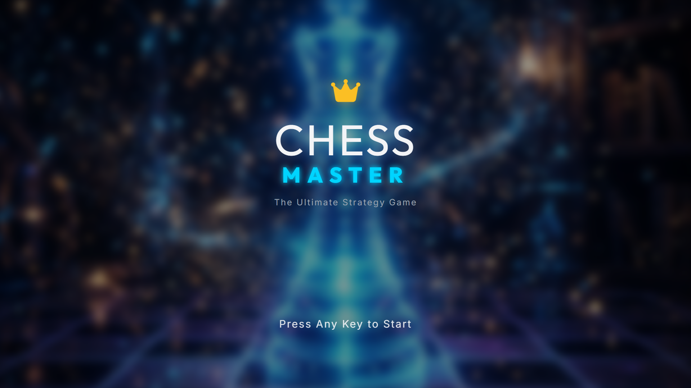
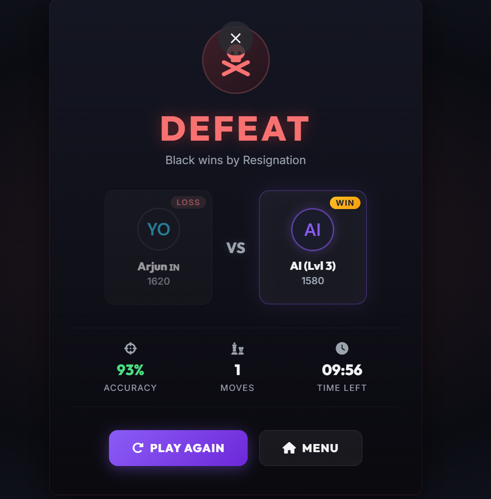

# ♛ MASTER CHESS ♛

<div align="center">


<br>


<br><br>

<a href="https://github.com/TechnicalSirius/Master-Chess/stargazers">

</a>

<a href="https://github.com/TechnicalSirius/Master-Chess/network/members">

</a>

<a href="https://github.com/TechnicalSirius/Master-Chess/issues">

</a>


<br><br>


</div>

---

# ⚔️ ENTER THE WORLD OF MASTER CHESS

<div align="center">



</div>

> MASTER CHESS is not just a game.  
> It is a premium battlefield of strategy, intelligence, and domination.

Designed with futuristic UI, smooth animations, advanced chess systems, and professional gameplay experience.

---

# 🌟 LIVE DEMO

<div align="center">

<a href="https://chessmaster.vercel.app">


</a>

</div>

---

# ✨ WHY MASTER CHESS IS DIFFERENT

<div align="center">

| ♟️ Gameplay Engine | 🎨 Premium Interface | 🚀 Advanced Systems |
|:------------------:|:-------------------:|:-------------------:|
| Real Chess Rules | Glassmorphism UI | AI Opponent |
| Smart Piece Logic | Dynamic Animations | Match Replay |
| Checkmate Detection | Neon Effects | Save Progress |
| Smooth Movements | Responsive Design | Move History |
| Legal Move Highlight | Dark Mode | Timer System |
| Winning System | Futuristic Menus | Multiplayer Ready |

</div>

---

# 💎 PREMIUM EXPERIENCE

<div align="center">

<table>
<tr>

<td align="center" width="33%">

## ⚡ Lightning Fast

Optimized rendering  
Smooth animations  
Instant response  

</td>

<td align="center" width="33%">

## 🎨 Cinematic UI

Modern visuals  
Glass effects  
Neon aesthetics  

</td>

<td align="center" width="33%">

## ♛ True Chess Logic

Professional rules  
Advanced systems  
Tournament ready  

</td>

</tr>
</table>

</div>

---

# 🎥 LIVE GAMEPLAY

<div align="center">


</div>

---

# 🖼️ GAME PREVIEW

<div align="center">

<table>
<tr>

<td align="center">

<br><br>
<h3>🏠 SPLASH SCREEN</h3>
</td>

<td align="center">

<br><br>
<h3>♟️ MENU</h3>
</td>

</tr>

<tr>

<td align="center">

<br><br>
<h3>GAME BOARD</h3>
</td>

<td align="center">

<br><br>
<h3>💀 DEFEAT SCREEN</h3>
</td>

</tr>
</table>

</div>

---

# 🔥 CORE FEATURES

## ♟️ PROFESSIONAL GAMEPLAY

```diff
+ Real Chess Mechanics
+ Smart Move Validation
+ Piece Capture System
+ Check & Checkmate Detection
+ Draw Detection
+ Legal Move Highlighting
+ Smooth Piece Animation
```

---

## 🎨 MODERN USER INTERFACE

```diff
+ Futuristic Design
+ Glassmorphism Effects
+ Responsive Layout
+ Beautiful Animations
+ Neon UI Effects
+ Dark/Light Themes
+ Dynamic Chess Boards
```

---

## 🚀 ADVANCED FEATURES

```diff
+ AI Opponent
+ Match Timer
+ Save/Load Game
+ Move History
+ Undo/Redo Moves
+ Fullscreen Support
+ Multiplayer System (Upcoming)
```

---

# 🤖 AI SYSTEM

<div align="center">

| Difficulty | Description |
|------------|-------------|
| Easy | Beginner Friendly |
| Medium | Balanced Strategy |
| Hard | Advanced Tactical AI |
| Master | Brutal Competitive Logic |

</div>

### AI analyzes:
- Board Control
- Piece Safety
- Tactical Opportunities
- Checkmate Patterns
- Positional Advantages

---

# 🛠️ TECH STACK

<div align="center">


</div>

| Technology | Purpose |
|------------|----------|
| HTML5 | Structure |
| CSS3 | Styling & Effects |
| JavaScript | Chess Logic |
| GitHub | Repository Hosting |

---

# 📂 PROJECT STRUCTURE

```bash
MASTER-CHESS/
│
├── � index.html
├── 📄 README.md
├── 📄 LICENSE
├── 🎨 style.css
│
├── 📁 assets
│   ├── 🖼️ Image/
│   ├── ♟️ pieces/
│   ├── 🎥 preview/
│   └── 📸 screenshots/
│   
└── 📁 js
    ├── 🤖 ai.js
    ├── ♟️ board.js
    ├── ✨ effects.js
    ├── 🧠 logic.js
    ├── 🎮 script.js
    ├── ⏱️ timer.js
    └── 🎨 ui.js
```

---

# ⚡ QUICK START

## 📥 INSTALLATION

```bash
git clone https://github.com/TechnicalSirius/Master-Chess.git
```

```bash
cd Master-Chess
```

---

## ▶️ RUN THE GAME

```bash
Open index.html in your browser
```

---

# 🎮 GAME CONTROLS

<div align="center">

| 🎯 Action | ⌨️ Control |
|-----------|------------|
| Select Piece | Left Click |
| Move Piece | Left Click |
| Undo Move | Ctrl + Z |
| Restart Match | R |
| Open Settings | ESC |

</div>

---

# 🏆 PROJECT ACHIEVEMENTS

<div align="center">

🥇 Modern Chess UI  
⚡ Advanced JavaScript Logic  
🎨 Premium Game Design  
🚀 Optimized Performance  
♟️ Real Chess Experience  

</div>

---


# 🤝 CONTRIBUTION

```bash
# Fork Repository

# Clone Project
git clone https://github.com/TechnicalSirius/Master-Chess.git

# Create New Branch
git checkout -b feature/NewFeature

# Commit Changes
git commit -m "Added New Feature"

# Push Branch
git push origin feature/NewFeature
```

---

# 👑 DEVELOPER

<div align="center">


# 🚀 TechnicalSirius

### ⚡ Creative Developer • UI Designer • Game Creator

<br>

<a href="https://github.com/TechnicalSirius">

</a>

<br><br>


</div>

---

# ⭐ SUPPORT THE PROJECT

<div align="center">

### 💖 If you love this project

⭐ Star this Repository  
🍴 Fork this Repository  
🚀 Share with Friends  

<br><br>


# ♛ MASTER CHESS ♛

### “Every Move Decides Your Destiny.”

</div>